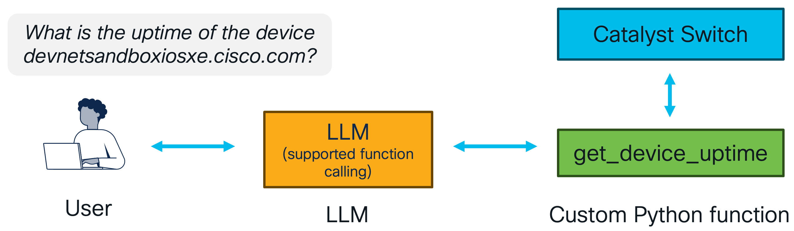
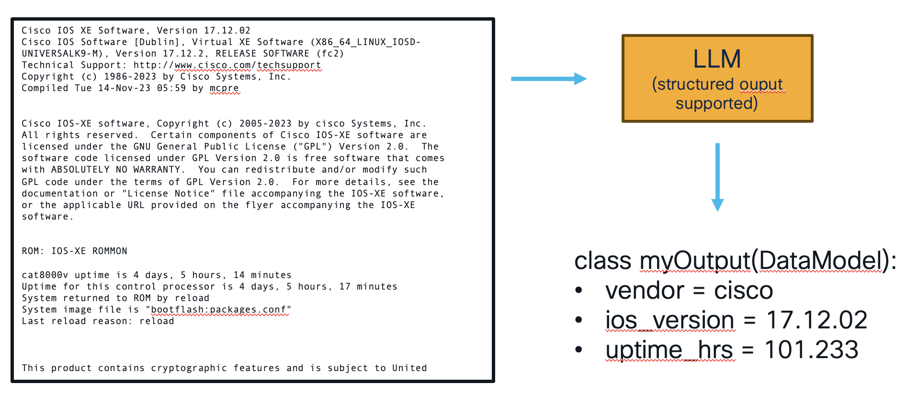
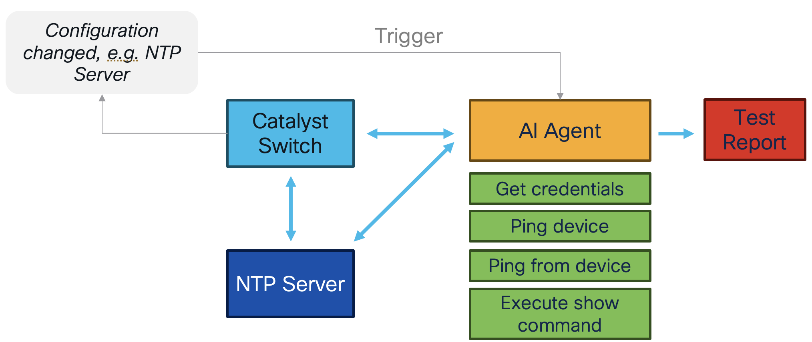
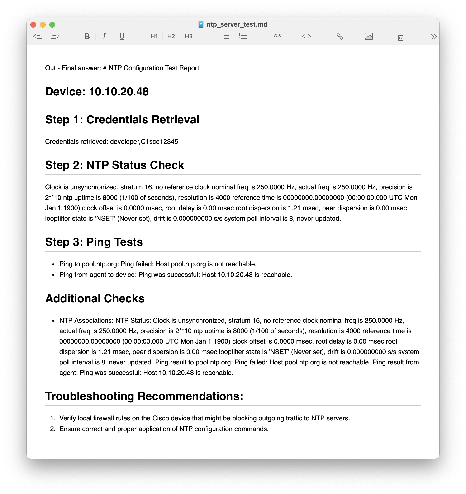
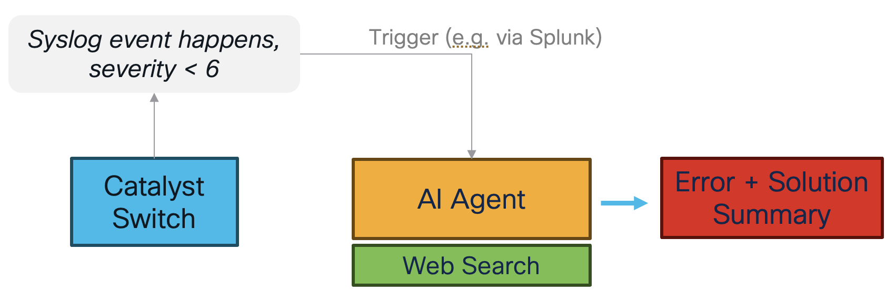

# Unlocking AI Agents for Network Engineering

Welcome to this learning lab! Make your first steps using AI agents in network engineering.

After this lab you will **understand more about:**

* AI agents
* Function/Tool Calling
* Structured Outputs
* How you can use AI agents with Cisco networking devices

**Lab Components**:

* **Python Libraries**: Smolagents, Ollama, netmiko, ncclient
* **Cisco Catalyst 8000V** - IOS XE
* **Large Language Models**: llama3.1, Qwen2.5

> **Be aware**: In this lab we are using local LLMs with only 8B parameters. I would strongly recommend to use more powerful local LLMs or use a Cloud LLM service for these tasks to get better results.

**Prerequsites** for this lab:

* Python skills
* Executing CLI commands

### Why AI Agents?

AI-powered agents are revolutionizing network engineering by automating complex tasks, enhancing troubleshooting, and improving overall efficiency. Traditional network operations often require manual intervention, extensive scripting, and deep domain expertise. AI agents provide:

- **Automation of Repetitive Tasks**: AI can handle log analysis, anomaly detection, and automated troubleshooting.
- **Predictive Maintenance**: Machine learning models can predict potential failures before they occur.
- **Enhanced Decision-Making**: AI-driven recommendations based on historical data and real-time telemetry.

### The Future of AI in Network Engineering
1. **Automated Log Analysis**: AI agents analyze syslog messages to detect anomalies and provide solutions.
2. **Self-Healing Networks**: AI agents detect network failures and apply predefined remediation steps.
3. **Network Optimization**: AI predicts bandwidth congestion and suggests optimizations.

---

## 1. Check your connectivity

Let's check if you can connect to the Catalyst switch. (Alternatively, you can use the DevNet always-on sandbox in some scenarios).

In the second step check, if you can run prompts to your local LLM.

## 2. Create Your First AI Agent with `smolagents`

### About smolagents

[`smolagents`](https://github.com/smol-ai/smolagents) is a lightweight Python framework designed for building AI-powered autonomous agents. It simplifies the integration of Large Language Models (LLMs) with function calling and decision-making capabilities.

The **Hugging Face** team is behind this framework. Hugging Face is the largest AI community and provides a robust ecosystem for AI models, including transformers, LLMs, and inference APIs.

It is a very new framework, released in December 2024, but gained a lot of popularity quickly.

### Writing a Simple AI Agent

Let's start writing our first AI agent in this framework and learn more about its components.

Create a basic AI agent:

```python
from smolagents.agents import CodeAgent
from smolagents import LiteLLMModel

model = LiteLLMModel(model_id="ollama/qwen2.5",
                     num_ctx=8192
                )

device_agent = CodeAgent(
                tools=[],
                model=model
)

device_agent.run("What does sh ip route do?")
```

---

## 3. Important Building Blocks for AI Agents

In order to understand AI agents, it is important to know these building blocks of AI agentic frameworks:

* Understanding the Agentic Behavior: ReACT, CodeAgents
* Function/Tool Calling
* Structured Output

### 3.1 Understanding the Agentic Behavior

Many AI agents are based on ReAct (Reasoning + Action), a paradigm that combines reasoning and acting with LLMs ([Yao et al., 2022](https://arxiv.org/abs/2210.03629)). It basically allows to learn new tasks and make decisions or reasoning.

Smolagents is writing these tasks of action items directly as code and suggest that this is the way to go according to their survey: [If LLM Is the Wizard, Then Code Is the Wand: A Survey on How Code Empowers Large Language Models to Serve as Intelligent Agents](https://huggingface.co/papers/2401.00812).

#### Using OpenTelemetry for Understanding & Debugging

Luckily smolagents adopted the OpenTelemetry standard for instrumenting agent runs. This allows us to monitor AI agents, track inputs/outputs, and detect failures.

In order to track all features we need to do 2 things:

#### 1. Start OpenTelemetry Server

**Open a terminal** and run in **your project folder** the following command:

```
python -m phoenix.server.main serve
```

The server will start which you can access at: [http://0.0.0.0:6006/projects/](http://0.0.0.0:6006/projects/)

> **Tip**: If you have not activated your Python environment yet, you can also use the command `poetry run <command from above>`  in the project folder to execute commands within your Python environment.

#### 2. Inject the Python code in our code

```python
# ================== TELEMETRY ==================
from opentelemetry.sdk.trace import TracerProvider
from openinference.instrumentation.smolagents import SmolagentsInstrumentor
from opentelemetry.exporter.otlp.proto.http.trace_exporter import OTLPSpanExporter
from opentelemetry.sdk.trace.export import SimpleSpanProcessor
endpoint = "http://0.0.0.0:6006/v1/traces"
trace_provider = TracerProvider()
trace_provider.add_span_processor(SimpleSpanProcessor(OTLPSpanExporter(endpoint)))
SmolagentsInstrumentor().instrument(tracer_provider=trace_provider)
```

This logs each AI-agent interaction in detail where you can understand the agentic behavior. This is definitely **not a black-box** like a LLM.


### 3.2 Function/Tool Calling with LLMs



**How Function Calling Works**

Modern LLMs, like OpenAI's GPT-4 and Meta’s LLaMA, support function calling by interpreting user input and invoking predefined functions.

1. **User Input** → LLM processes the request.
2. **Tool Matching** → LLM determines the most relevant function.
3. **Execution** → The function executes and returns results.
4. **Response** → The LLM formats and delivers the response.

### Extending our Agent with function calling

The custom functions `get_username_password_for_device` and `show_running_configuration` are already defined in the Jupyter Notebook. Do not forget to execute the cell as well!

```python
from smolagents.agents import CodeAgent
from smolagents import LiteLLMModel

model = LiteLLMModel(model_id="ollama/qwen2.5",
                     num_ctx=8192)

device_agent = CodeAgent(tools=[get_username_password_for_device,
                         show_ip_route],
                  model=model,
                  additional_authorized_imports=['ncclient', 'netmiko','requests','paramiko','io'],
                 )
# give the sandboxed Python interpreter access to read/write files outside (use with caution!)
device_agent.python_executor.static_tools["open"] = open

# Routing Table Summary as Markdown
device_agent.run("""
                 Summarize the routing table on the Cisco device 10.10.20.48.
                 Save it in the Markdown file 'routing_table_summary.md'.
                 You will at first need the username and password for the device.
                 """)
```

After execution, the LLM intelligently calls `get_username_password_for_device` first and then `show_running_configuration` based on the input.

### 3.3 Structured Output with LLMs



LLMs often generate free-form text. With structured outputs you can generate an output what you are defining. **Structured outputs** is a feature that ensures the model will always generate responses that adhere to your **supplied JSON Schema**.

**How It Works**

1. You define the output schema and prompt.
2. The LLM is prompted to generate the values based on your schema.

### Code-Example

```python
from pydantic import BaseModel

# here we define the model for the response
class Cat8000(BaseModel):
    ios_version: str
    configuration_register: str

# define your parameters
ios_show_command = "show version"
device_host = "10.10.20.48" # or "devnetsandboxiosxe.cisco.com"
```

Copy and past this code to define the output schema.

---

## 4. Use Cases

In Jupyter Lab, open the folder `complete _examples`, click on the **blue PLUS** (top left corner) and open a **Terminal**.

Now you can run any of these example use-cases using the follow command:

```
python <name-of-the-script.py>
```

Check the output in the Terminal and via OpenTelemetry!


### Configuration Post-Check NTP

After applying a new configuration to a catalyst router, the AI agents is applying several tests in order to check if the configuration was applied correctly and is working as expected.

Feel free to set/change the NTP configuration to see different results.



> **Good to know**: Because of security reasons, ping operations are restricted in our DevNet sandbox environment (e.g. ping to 8.8.8.8 is not allowed).

This example shows a changed NTP server configuration, but it works with other commands as well.

**Example Output**:



---

### Analyze Syslog Errors with Web-search

In this use-case an AI agent is receiving syslog error messages and searching the web for this issue to gather more information. It then suggested solutions to this error.



### More Examples

Check out the folder `complete_examples` for all use-cases to test.

---

## Conclusion
By leveraging AI agents, function calling, structured output, telemetry, and real-world use cases, network engineers can improve automation and troubleshooting efficiency. This lab equips you with the foundational skills to integrate AI-driven agents into network engineering workflows.

## DevNet Sandbox Information

Reserve your IOS XE Cat8000V Sandbox on [https://devnetsandbox.cisco.com/](https://devnetsandbox.cisco.com/).

## Authors

* **Flo Pachinger** - *Initial work* - [flopach](https://github.com/flopach)

## License

This project is licensed under the Cisco Sample Code License 1.1 - see the [LICENSE.md](LICENSE.md) file for details.

## Further Links

* [Cisco DevNet Website](https://developer.cisco.com)